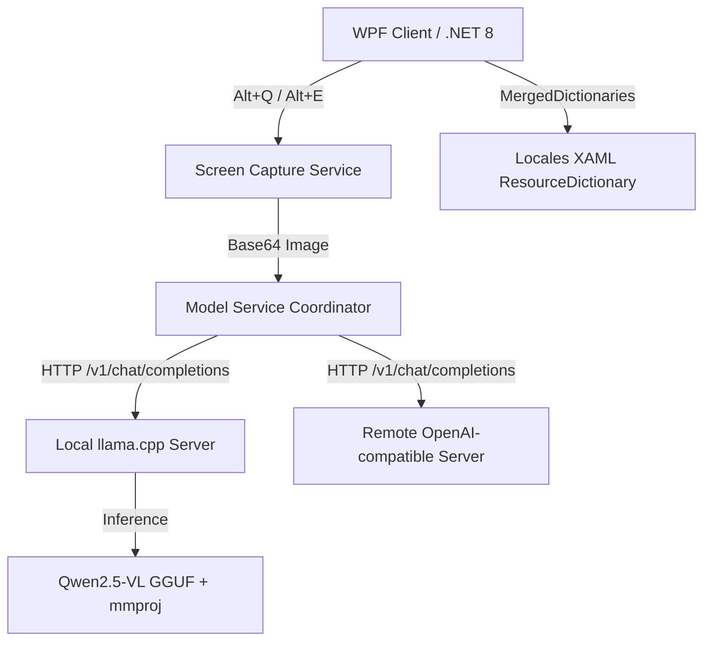

# TransPilot - KI-gestützte Bildschirmübersetzung & Tabellenerkennung

---

`TransPilot` ist ein **On-Device Multimodaler KI-Assistent** der nächsten Generation für Windows. Es integriert die lokale beschleunigte Inferenz-Engine `llama.cpp` mit dem multimodalen Vision Language Model `Qwen2.5-VL` und ermöglicht präzise **Screenshot-Übersetzungen** und **intelligente Tabellen-OCR-Extraktion** vollständig offline, mit 100% Datenschutz für Unternehmens- und persönliche Daten.

Dieses Projekt wird derzeit als **Closed-Source-Paket** vertrieben. Dieses Repository dient als Produktpräsentation, Versions-Release-Hub, Benutzerhandbuch und Feedback-Center.

---

## ✨ Kernfunktionen

* 🌐 **Multimodale LLM Intelligente Übersetzung (Alt + Q)**
  Durch Nutzung der multimodalen Vision-Fähigkeiten von `Qwen2.5-VL` führt es nicht nur OCR-Erkennung durch, sondern versteht auch den Kontext von Screenshots für präzise mehrsprachige Übersetzungen.
* 📊 **On-Device Intelligente Tabellenerkennung & Excel-Export (Alt + E)**
  Für alle Finanzberichte, Ausschreibungsunterlagen oder Datentabellen auf dem Bildschirm extrahiert ein Ein-Klick-Screenshot automatisch strukturierte Daten und generiert Standard-`.xlsx`-Dateien, wodurch manuelle Dateneingabe entfällt.
* 🔒 **100% Lokaler Offline-Datenschutz**
  Bilder und Screenshots werden vollständig im lokalen Speicher und auf On-Device-Modellen verarbeitet, **ohne Upload zu externen Cloud-Diensten**. Ideal für interne Netzwerke und Hochsicherheitsabteilungen mit strengen Vertraulichkeitsanforderungen für Geschäftsgeheimnisse, Finanzdaten und Ausschreibungsinformationen.
* 🖥️ **WPF Ästhetische Exzellenz & 10-Sprachen Sofortumschaltung**
  Entwickelt mit fortschrittlicher WPF Dynamic Resource Dictionary (`ResourceDictionary`) Technologie. Unterstützt 10 Sprachen einschließlich Chinesisch, Englisch, Deutsch, Italienisch, Spanisch, Russisch, Portugiesisch, Japanisch, Koreanisch und Arabisch mit **sofortigen, nahtlosen WYSIWYG-Interface-Updates**, ohne gemischte Sprachangeigen und Flackern.
* 🔌 **Einfache OpenAI-kompatible API-Erweiterung**
  Das Programm verwaltet nicht nur automatisch startende lokale Dienste mit einem Klick, sondern unterstützt auch benutzerdefinierte Dienstadressen, die mit OpenAI / llama.cpp kompatibel sind, zur einfachen Integration von Cloud- oder unternehmensbasierten zentralisierten GPU-Übersetzungsservern.

---

## 🛠️ Technische Architektur



### Warum muss ein Multimodales Vision Language Model (VLM) verwendet werden?
Screenshot-Übersetzung erfordert grundsätzlich "visuelles Verständnis", nicht nur reine Textübersetzung; Tabellenerkennung hängt stark von Bildinhaltslayout und Rahmenerkennung ab. Daher muss das Modell **multimodale Vision-Modelle (wie Qwen2.5-VL)** mit Vision-Projektionsdateien (`mmproj`) verwenden. Traditionelle reine Text-Large-Language-Models können solche Szenarien nicht bewältigen.

---

## 📥 Release-Versionen & Download-Optionen

Wir bieten zwei Vertriebspakete für unterschiedliche Anwendungsfälle:

### 1. Vollständiges Paket (Gebündeltes Modell, Sofort Einsatzbereit)
* **Release-Datei**: `TransPilot-v1.1.2-full.zip`
* **Geeignet für**: Einzelbenutzer, lokale Einzelrechner-Hochfrequenznutzung, Benutzer, die keine Modelle manuell herunterladen oder Kompilierungsumgebungen konfigurieren möchten.
* **Enthält**:
  - `TransPilot.exe` Client-Anwendung
  - `runtime/llama.cpp/` (vorkompiliertes Windows CPU- oder GPU-Beschleunigungskit)
  - `runtime/models/Qwen2.5-VL-7B-Instruct-q4_k_m.gguf` (7B Hauptmodell)
  - `runtime/models/mmproj-F16.gguf` (Vision-Projektionsdatei)
  - Standard-Konfigurationsdateien

### 2. Standard-/Framework-Abhängiges Paket (Leichtgewichtiger Client, Freie Integration)
* **Release-Datei**: `TransPilot-v1.1.2.zip` oder `TransPilot-FDD`
* **Geeignet für**: Administratoren, Unternehmens-IT, Entwickler mit vorhandenen lokalen oder Remote-Inferenzdiensten.
* **Enthält**: Nur die Client-Anwendung (wenige MB) und Konfigurationsdateien, ohne große Modelle und Inferenz-Backend, vollständig konfiguriert zur Verbindung mit vorhandenen API-Schnittstellen über Netzwerk.

---

## 🚀 Lokale Konfigurationsanleitung

Wenn Sie das **Standard-Paket** verwenden oder Ihre eigenen Modelle und Umgebungen in der Vollversion anpassen/aktualisieren möchten, folgen Sie bitte diesen Konfigurationsschritten:

### Schritt 1: Hauptmodell & Vision-Projektionsdatei Herunterladen
Die Standard-Modellverzeichnisstruktur:
```text
TransPilot/
  TransPilot.exe
  runtime/
    models/
      Qwen2.5-VL-7B-Instruct-q4_k_m.gguf  <-- Hauptmodell
      mmproj-F16.gguf                      <-- Projektionsdatei
```
* **[Hauptmodell Download]**: [Qwen2.5-VL-7B-Instruct-Q4_K_M.gguf (Empfohlene 7B-Quantisierung)](https://huggingface.co/ggml-org/Qwen2.5-VL-7B-Instruct-GGUF/resolve/main/Qwen2.5-VL-7B-Instruct-Q4_K_M.gguf)
* **[Projektionsdatei Download]**: [mmproj-F16.gguf (Muss mit Hauptmodell übereinstimmen)](https://huggingface.co/unsloth/Qwen2.5-VL-7B-Instruct-GGUF/resolve/main/mmproj-F16.gguf)

### Schritt 2: Inferenz-Engine llama-server Herunterladen
Basierend auf Ihrer GPU-Konfiguration laden Sie das entsprechende Paket von [llama.cpp Releases](https://github.com/ggml-org/llama.cpp/releases) herunter:
* **Mit NVIDIA GPU** (Sehr empfohlen, extrem schnell): Dateien mit `win-cuda-x64` herunterladen, z.B. [llama-b8733-bin-win-cuda-12.4-x64.zip](https://github.com/ggml-org/llama.cpp/releases/download/b8733/llama-b8733-bin-win-cuda-12.4-x64.zip).
* **Nur CPU**: Dateien mit `win-cpu-x64` herunterladen, z.B. [llama-b8733-bin-win-cpu-x64.zip](https://github.com/ggml-org/llama.cpp/releases/download/b8733/llama-b8733-bin-win-cpu-x64.zip).

Nach dem Download extrahieren Sie alle Dateien einschließlich `llama-server.exe`, `llama.dll`, `ggml.dll` und platzieren Sie sie im Verzeichnis `runtime/llama.cpp/`.

---

## 🏢 Unternehmens-Zentralisierte Server-Bereitstellungsanleitung

Für Multi-User-Sharing, Reduzierung des Einzelrechner-Ressourcen-Overheads und einheitliches Management empfehlen wir die Bereitstellung von `llama.cpp` auf einem Unternehmens-LAN-Server (mit starker GPU) und das Verweisen aller Mitarbeiter-Client-APIs auf diese Adresse.

### 1. Windows Server Startskript-Beispiel
Erstellen Sie `start-server.bat` auf dem Server:
```bat
@echo off
chcp 65001 >nul
cd /d "D:\TransPilot\llama.cpp"
llama-server.exe ^
  -m "D:\TransPilot\models\Qwen2.5-VL-7B-Instruct-q4_k_m.gguf" ^
  --mmproj "D:\TransPilot\models\mmproj-F16.gguf" ^
  -c 16384 ^
  -np 4 ^
  -ngl 25 ^
  -t 8 ^
  --port 8081 ^
  --host 0.0.0.0
```

### 2. Linux Server Startbefehl-Beispiel
```bash
./llama-server \
  -m /opt/models/Qwen2.5-VL-7B-Instruct-q4_k_m.gguf \
  --mmproj /opt/models/mmproj-F16.gguf \
  -c 16384 \
  -np 4 \
  -ngl 25 \
  -t 8 \
  --port 8081 \
  --host 0.0.0.0
```

### 3. Multi-User-Parallelitätskonfiguration (`-c` & `-np` Balance)
* **Kleines Team (~5 Benutzer)**: Einzelinstanz ausreichend. Empfohlen: `-c 16384 -np 4` (16k Gesamtkontext, 4 parallele Slots für Time-Sharing).
* **Mittleres-Großes Team (15-30 Benutzer)**: Verwenden Sie **Multi-Instanz-Bereitstellung**, um Verbindungsabbrüche und Warteschlangen zu verhindern. Starten Sie mehrere `llama-server`-Instanzen auf verschiedenen Ports und verwenden Sie Nginx für Reverse Proxy und Load Balancing.

---

## ⌨️ Tastenkombinationen

| Tastenkombination | Funktion |
| :--- | :--- |
| `Alt + Q` | **Screenshot-Übersetzung**: Bildschirmbereich erfassen, automatisch Bild-OCR-Extraktion durchführen, kontextuelle Übersetzung und Darstellung im rechten Panel mit Ein-Klick-Kopie. |
| `Alt + E` | **Tabellenerkennung**: Screenshot zur Tabellenauswahl, Struktur erkennen und auf der rechten Seite in der Vorschau anzeigen, automatisch exportieren und lokale `.xlsx`-Datei generieren. |

---

## 🌐 Mehrsprachige Benutzeroberfläche

Nahtloser Wechsel zwischen 10 Sprachen im Einstellungsfenster:
* 🇨🇳 简体中文 (zh-CN) | 🇺🇸 English (en) | 🇩🇪 Deutsch (de)
* 🇮🇹 Italiano (it) | 🇪🇸 Español (es) | 🇷🇺 Русский (ru)
* 🇵🇹 Português (pt) | 🇯🇵 日本語 (ja) | 🇰🇷 한국어 (ko)
* 🇸🇦 العربية (ar)

---

## ❓ FAQ

#### F1: Warum wird beim Start "Integrierter Modelldienst konnte nicht gestartet werden" angezeigt?
* Überprüfen Sie, ob das Verzeichnis `runtime/llama.cpp/` `llama-server.exe` und alle abhängigen `.dll`-Dateien enthält.
* Überprüfen Sie, ob GPU-Treiber CUDA unterstützen; falls nicht, ersetzen Sie `llama-server` durch CPU-Version.
* Überprüfen Sie im Task-Manager auf verbleibende `llama-server`-Prozesse, die den Port belegen, und beenden Sie diese zwangsweise.

#### F2: Warum ist die Screenshot-Erkennung oder Tabellenverarbeitung sehr langsam?
* Bestätigen Sie, ob GPU-Hardwarebeschleunigung aktiviert ist. Bei vollständiger CPU-Ausführung dauert es aufgrund des VLM-Modell-Rechenaufwands typischerweise 20-30 Sekunden.
* Überprüfen Sie Screenshot-Auflösung und -Größe; übermäßig große Erfassungsbereiche (z.B. Dual-4K-Bildschirme) erhöhen die Modell-Token-Berechnung exponentiell.

#### F3: Anforderungsfehler bei gleichzeitiger Multi-User-Nutzung?
* Vision Language Model (VLM)-Anforderungen benötigen erheblichen VRAM. Bei hoher Parallelität erhöhen Sie den `-c`-Parameter (Gesamtkontext) oder reduzieren Sie parallele Slots `-np`, oder übernehmen Sie die in diesem Leitfaden empfohlene Multi-Instanz-Verteilungslösung.

---

## ☕ Unterstützung & Sponsoring

Wenn `TransPilot` Ihre tägliche Arbeit erleichtert hat, können Sie dem Autor gerne einen Kaffee spendieren, um die kontinuierliche Wartung zu unterstützen:
Wir haben Unterstützungskanäle in der Hauptoberfläche und im Sponsoring-Fenster integriert (sanfte Erinnerungen im Schließen-/Einstellungsablauf). Willkommen zum Sponsoring über WeChat Pay, Alipay QR-Code oder internationales PayPal.

---

## 📖 Andere Sprachen

- [简体中文](README.md)
- [English](README.en.md)
- [Français](README.fr.md)
