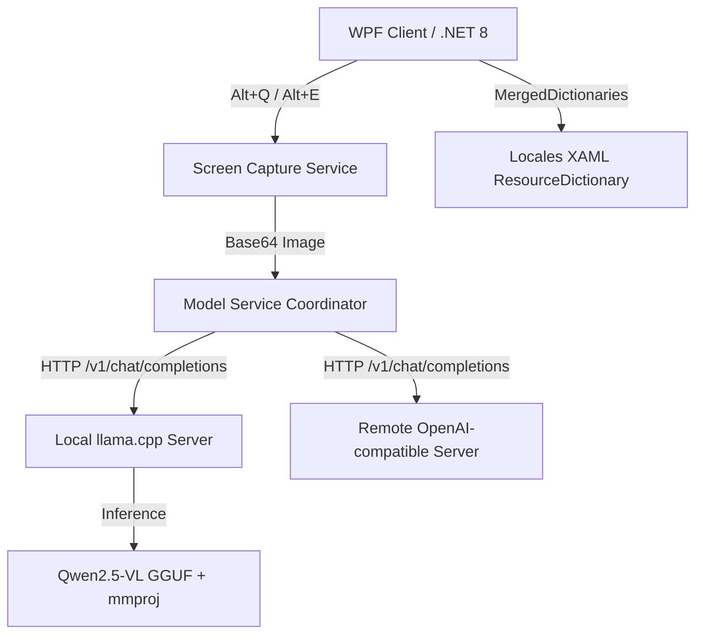

# TransPilot - AI-Powered Screen Translation & Table Recognition Tool

---

`TransPilot` is a next-generation **on-device multimodal AI assistant** designed for Windows. It integrates the local accelerated inference engine `llama.cpp` with the multimodal vision language model `Qwen2.5-VL`, enabling precise **screenshot translation** and **intelligent table OCR extraction** completely offline, ensuring 100% privacy protection for enterprise and personal data.

This project is currently distributed as a **closed-source package**. This repository serves as the product introduction, version release hub, user guide, and feedback center.

---

## ✨ Core Features

* 🌐 **Multimodal LLM Intelligent Translation (Alt + Q)**
  Leveraging `Qwen2.5-VL`'s multimodal vision capabilities, it not only performs OCR recognition but also understands the context of screenshots to provide accurate multilingual translations.
* 📊 **On-Device Intelligent Table Recognition & Excel Export (Alt + E)**
  For any financial reports, tender documents, or data tables on screen, one-click screenshot automatically extracts structured data and generates standard `.xlsx` files, eliminating manual data entry.
* 🔒 **100% Local Offline Privacy Protection**
  Images and screenshots are processed entirely in local memory and on-device models, **without uploading to external cloud services**. Ideal for internal networks and high-security departments with strict confidentiality requirements for business secrets, financial data, and tender information.
* 🖥️ **WPF Aesthetic Excellence & 10-Language Instant Hot-Switching**
  Built with advanced WPF dynamic resource dictionary (`ResourceDictionary`) technology. Supports 10 languages including Chinese, English, German, Italian, Spanish, Russian, Portuguese, Japanese, Korean, and Arabic with **instant, seamless, WYSIWYG interface updates**, eliminating mixed-language displays and flickering.
* 🔌 **Simple OpenAI-Compatible API Extension**
  The program not only manages auto-starting local services with one click but also supports custom service addresses compatible with OpenAI / llama.cpp, easily integrating cloud or company-deployed centralized GPU translation servers.

---

## 🛠️ Technical Architecture



### Why Must Use Multimodal Vision Language Model (VLM)?
Screenshot translation fundamentally requires "visual understanding", not just pure text translation; table recognition heavily depends on image content layout and border recognition. Therefore, the model must use **multimodal vision models (like Qwen2.5-VL)** with vision projection files (`mmproj`). Traditional text-only large language models cannot handle such scenarios.

---

## 📥 Release Versions & Download Options

We provide two distribution packages for different use cases:

### 1. Full Package (Bundled Model, Ready to Use)
* **Release File**: `TransPilot-v1.1.2-full.zip`
* **Suitable For**: Individual users, local single-machine high-frequency use, users who don't want to manually download models or configure compilation environments.
* **Includes**:
  - `TransPilot.exe` client application
  - `runtime/llama.cpp/` (pre-compiled Windows CPU or GPU acceleration kit)
  - `runtime/models/Qwen2.5-VL-7B-Instruct-q4_k_m.gguf` (7B main model)
  - `runtime/models/mmproj-F16.gguf` (vision projection file)
  - Default configuration files

### 2. Standard/Framework Dependent Package (Lightweight Client, Free Integration)
* **Release File**: `TransPilot-v1.1.2.zip` or `TransPilot-FDD`
* **Suitable For**: Administrators, corporate IT, developers with existing local or remote inference services.
* **Includes**: Only the client application (few MB) and configuration files, without large models and inference backend, fully configured to connect to existing API interfaces via network.

---

## 🚀 Local Configuration Guide

If you're using the **standard package**, or wish to customize/update your own models and environment in the full version, please refer to the following configuration steps:

### Step 1: Download Main Model & Vision Projection File
The default model directory structure:
```text
TransPilot/
  TransPilot.exe
  runtime/
    models/
      Qwen2.5-VL-7B-Instruct-q4_k_m.gguf  <-- Main model
      mmproj-F16.gguf                      <-- Projection file
```
* **[Main Model Download]**: [Qwen2.5-VL-7B-Instruct-Q4_K_M.gguf (Recommended 7B quantization)](https://huggingface.co/ggml-org/Qwen2.5-VL-7B-Instruct-GGUF/resolve/main/Qwen2.5-VL-7B-Instruct-Q4_K_M.gguf)
* **[Projection File Download]**: [mmproj-F16.gguf (Must match main model)](https://huggingface.co/unsloth/Qwen2.5-VL-7B-Instruct-GGUF/resolve/main/mmproj-F16.gguf)

### Step 2: Download Inference Engine llama-server
Based on your GPU configuration, download the corresponding package from [llama.cpp Releases](https://github.com/ggml-org/llama.cpp/releases):
* **With NVIDIA GPU** (Highly recommended, extremely fast): Download files with `win-cuda-x64`, e.g., [llama-b8733-bin-win-cuda-12.4-x64.zip](https://github.com/ggml-org/llama.cpp/releases/download/b8733/llama-b8733-bin-win-cuda-12.4-x64.zip).
* **CPU Only**: Download files with `win-cpu-x64`, e.g., [llama-b8733-bin-win-cpu-x64.zip](https://github.com/ggml-org/llama.cpp/releases/download/b8733/llama-b8733-bin-win-cpu-x64.zip).

After downloading, extract all files including `llama-server.exe`, `llama.dll`, `ggml.dll`, and place them in the `runtime/llama.cpp/` directory.

---

## 🏢 Enterprise Centralized Server Deployment Guide

For multi-user sharing, reducing single-machine resource overhead, and unified management, we recommend deploying `llama.cpp` on an enterprise LAN server (with strong GPU) and pointing all employee client APIs to that address.

### 1. Windows Server Startup Script Example
Create `start-server.bat` on the server:
```bat
@echo off
chcp 65001 >nul
cd /d "D:\TransPilot\llama.cpp"
llama-server.exe ^
  -m "D:\TransPilot\models\Qwen2.5-VL-7B-Instruct-q4_k_m.gguf" ^
  --mmproj "D:\TransPilot\models\mmproj-F16.gguf" ^
  -c 16384 ^
  -np 4 ^
  -ngl 25 ^
  -t 8 ^
  --port 8081 ^
  --host 0.0.0.0
```

### 2. Linux Server Startup Command Example
```bash
./llama-server \
  -m /opt/models/Qwen2.5-VL-7B-Instruct-q4_k_m.gguf \
  --mmproj /opt/models/mmproj-F16.gguf \
  -c 16384 \
  -np 4 \
  -ngl 25 \
  -t 8 \
  --port 8081 \
  --host 0.0.0.0
```

### 3. Multi-User Concurrency Configuration (`-c` & `-np` Balance)
* **Small Team (~5 users)**: Single instance sufficient. Recommended: `-c 16384 -np 4` (16k total context, 4 concurrent slots for time-sharing).
* **Medium-Large Team (15-30 users)**: Use **multi-instance deployment** to prevent disconnections and queuing. Start multiple `llama-server` instances on different ports and use Nginx for reverse proxy and load balancing.

---

## ⌨️ Keyboard Shortcuts

| Shortcut | Function |
| :--- | :--- |
| `Alt + Q` | **Screenshot Translation**: Capture screen area, automatically perform image OCR extraction, contextual translation, and render in right panel with one-click copy. |
| `Alt + E` | **Table Recognition**: Screenshot to select table, recognize structure and preview on right side, auto-export and generate local `.xlsx` file. |

---

## 🌐 Multilingual Interface Support

Seamlessly switch between 10 languages in the settings window:
* 🇨🇳 简体中文 (zh-CN) | 🇺🇸 English (en) | 🇩🇪 Deutsch (de)
* 🇮🇹 Italiano (it) | 🇪🇸 Español (es) | 🇷🇺 Русский (ru)
* 🇵🇹 Português (pt) | 🇯🇵 日本語 (ja) | 🇰🇷 한국어 (ko)
* 🇸🇦 العربية (ar)

---

## ❓ FAQ

#### Q1: Why does it prompt "Built-in model service failed to start" at startup?
* Check if `runtime/llama.cpp/` directory contains `llama-server.exe` and all dependent `.dll` files.
* Verify if GPU drivers support CUDA; if not, replace `llama-server` with CPU version.
* Check Task Manager for residual `llama-server` processes occupying the port and force terminate them.

#### Q2: Why is screenshot recognition or table processing very slow?
* Confirm if GPU hardware acceleration is enabled. Running entirely on CPU typically takes 20-30 seconds due to VLM model computational overhead.
* Check screenshot resolution and size; overly large capture areas (e.g., dual 4K screens) exponentially increase model token computation.

#### Q3: Request failures during multi-user concurrent use?
* Vision language model (VLM) requests require substantial VRAM. For high concurrency, increase the `-c` parameter (total context) or reduce concurrent slots `-np`, or adopt the multi-instance distribution solution recommended in this guide.

---

## ☕ Support & Sponsorship

If `TransPilot` has helped your daily work, feel free to buy the author a coffee to support continued maintenance:
We've integrated support channels in the main interface and sponsorship window (gentle reminders in close/settings flow). Welcome to sponsor via WeChat Pay, Alipay QR code, or international PayPal.

---

## 📖 Other Languages

- [简体中文](README.md)
- [Deutsch](README.de.md)
- [Français](README.fr.md)
