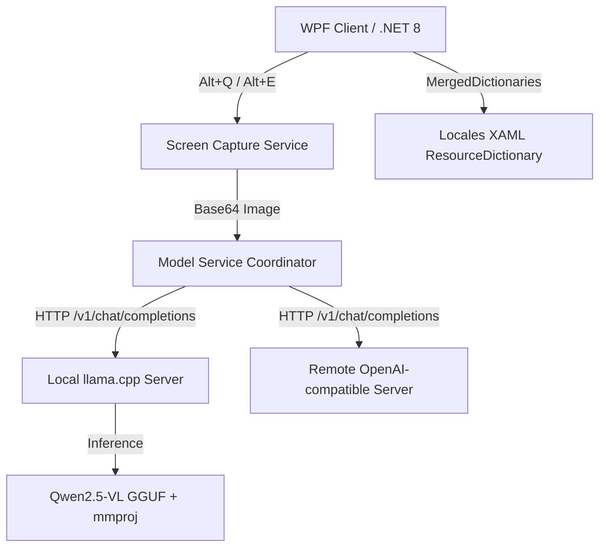

# TransPilot - Outil de Traduction d'Écran et Reconnaissance de Tableaux par IA

---

`TransPilot` est un **assistant IA multimodal sur appareil** de nouvelle génération conçu pour Windows. Il intègre le moteur d'inférence accélérée local `llama.cpp` avec le modèle de langage visuel multimodal `Qwen2.5-VL`, permettant une **traduction de captures d'écran** précise et une **extraction OCR intelligente de tableaux** entièrement hors ligne, garantissant une protection à 100% de la confidentialité des données d'entreprise et personnelles.

Ce projet est actuellement distribué sous forme de **package à source fermée**. Ce dépôt sert de présentation du produit, centre de publication de versions, guide d'utilisateur et centre de retours.

---

## ✨ Fonctionnalités Principales

* 🌐 **Traduction Intelligente LLM Multimodale (Alt + Q)**
  En exploitant les capacités de vision multimodale de `Qwen2.5-VL`, il effectue non seulement la reconnaissance OCR mais comprend également le contexte des captures d'écran pour fournir des traductions multilingues précises.
* 📊 **Reconnaissance Intelligente de Tableaux sur Appareil & Export Excel (Alt + E)**
  Pour tous les rapports financiers, documents d'appel d'offres ou tableaux de données à l'écran, une capture d'écran en un clic extrait automatiquement les données structurées et génère des fichiers `.xlsx` standard, éliminant la saisie manuelle des données.
* 🔒 **Protection de la Confidentialité Hors Ligne Locale à 100%**
  Les images et captures d'écran sont traitées entièrement dans la mémoire locale et sur les modèles sur appareil, **sans téléchargement vers des services cloud externes**. Idéal pour les réseaux internes et les départements de haute sécurité avec des exigences strictes de confidentialité pour les secrets commerciaux, les données financières et les informations d'appel d'offres.
* 🖥️ **Excellence Esthétique WPF & Commutation Instantanée 10 Langues**
  Construit avec la technologie avancée de dictionnaire de ressources dynamiques WPF (`ResourceDictionary`). Prend en charge 10 langues dont le chinois, l'anglais, l'allemand, l'italien, l'espagnol, le russe, le portugais, le japonais, le coréen et l'arabe avec des **mises à jour d'interface WYSIWYG instantanées et transparentes**, éliminant les affichages multilingues mixtes et les scintillements.
* 🔌 **Extension API Compatible OpenAI Simple**
  Le programme gère non seulement les services locaux à démarrage automatique en un clic, mais prend également en charge les adresses de service personnalisées compatibles avec OpenAI / llama.cpp, pour une intégration facile des serveurs de traduction GPU centralisés basés sur le cloud ou l'entreprise.

---

## 🛠️ Architecture Technique



### Pourquoi Doit-on Utiliser un Modèle de Langage Visuel Multimodal (VLM)?
La traduction de captures d'écran nécessite fondamentalement une "compréhension visuelle", pas seulement une traduction de texte pure; la reconnaissance de tableaux dépend fortement de la mise en page du contenu de l'image et de la reconnaissance des bordures. Par conséquent, le modèle doit utiliser des **modèles de vision multimodaux (comme Qwen2.5-VL)** avec des fichiers de projection de vision (`mmproj`). Les modèles de langage traditionnels uniquement textuels ne peuvent pas gérer de tels scénarios.

---

## 📥 Versions de Publication & Options de Téléchargement

Nous proposons deux packages de distribution pour différents cas d'usage:

### 1. Package Complet (Modèle Intégré, Prêt à l'Emploi)
* **Fichier de Publication**: `TransPilot-v1.1.2-full.zip`
* **Adapté Pour**: Utilisateurs individuels, utilisation locale haute fréquence sur une seule machine, utilisateurs qui ne souhaitent pas télécharger manuellement les modèles ou configurer des environnements de compilation.
* **Comprend**:
  - Application client `TransPilot.exe`
  - `runtime/llama.cpp/` (kit d'accélération CPU ou GPU Windows précompilé)
  - `runtime/models/Qwen2.5-VL-7B-Instruct-q4_k_m.gguf` (modèle principal 7B)
  - `runtime/models/mmproj-F16.gguf` (fichier de projection de vision)
  - Fichiers de configuration par défaut

### 2. Package Standard/Dépendant du Framework (Client Léger, Intégration Libre)
* **Fichier de Publication**: `TransPilot-v1.1.2.zip` ou `TransPilot-FDD`
* **Adapté Pour**: Administrateurs, informatique d'entreprise, développeurs avec des services d'inférence locaux ou distants existants.
* **Comprend**: Uniquement l'application client (quelques Mo) et les fichiers de configuration, sans grands modèles ni backend d'inférence, entièrement configuré pour se connecter aux interfaces API existantes via le réseau.

---

## 🚀 Guide de Configuration Locale

Si vous utilisez le **package standard** ou souhaitez personnaliser/mettre à jour vos propres modèles et environnements dans la version complète, veuillez suivre les étapes de configuration suivantes:

### Étape 1: Télécharger le Modèle Principal & le Fichier de Projection de Vision
La structure de répertoire de modèle par défaut:
```text
TransPilot/
  TransPilot.exe
  runtime/
    models/
      Qwen2.5-VL-7B-Instruct-q4_k_m.gguf  <-- Modèle principal
      mmproj-F16.gguf                      <-- Fichier de projection
```
* **[Téléchargement du Modèle Principal]**: [Qwen2.5-VL-7B-Instruct-Q4_K_M.gguf (Quantification 7B recommandée)](https://huggingface.co/ggml-org/Qwen2.5-VL-7B-Instruct-GGUF/resolve/main/Qwen2.5-VL-7B-Instruct-Q4_K_M.gguf)
* **[Téléchargement du Fichier de Projection]**: [mmproj-F16.gguf (Doit correspondre au modèle principal)](https://huggingface.co/unsloth/Qwen2.5-VL-7B-Instruct-GGUF/resolve/main/mmproj-F16.gguf)

### Étape 2: Télécharger le Moteur d'Inférence llama-server
En fonction de votre configuration GPU, téléchargez le package correspondant depuis [llama.cpp Releases](https://github.com/ggml-org/llama.cpp/releases):
* **Avec GPU NVIDIA** (Très recommandé, extrêmement rapide): Téléchargez les fichiers avec `win-cuda-x64`, par ex. [llama-b8733-bin-win-cuda-12.4-x64.zip](https://github.com/ggml-org/llama.cpp/releases/download/b8733/llama-b8733-bin-win-cuda-12.4-x64.zip).
* **CPU Uniquement**: Téléchargez les fichiers avec `win-cpu-x64`, par ex. [llama-b8733-bin-win-cpu-x64.zip](https://github.com/ggml-org/llama.cpp/releases/download/b8733/llama-b8733-bin-win-cpu-x64.zip).

Après le téléchargement, extrayez tous les fichiers y compris `llama-server.exe`, `llama.dll`, `ggml.dll` et placez-les dans le répertoire `runtime/llama.cpp/`.

---

## 🏢 Guide de Déploiement de Serveur Centralisé d'Entreprise

Pour le partage multi-utilisateurs, la réduction de la surcharge des ressources d'une seule machine et la gestion unifiée, nous recommandons de déployer `llama.cpp` sur un serveur LAN d'entreprise (avec GPU puissant) et de pointer toutes les API client des employés vers cette adresse.

### 1. Exemple de Script de Démarrage Serveur Windows
Créez `start-server.bat` sur le serveur:
```bat
@echo off
chcp 65001 >nul
cd /d "D:\TransPilot\llama.cpp"
llama-server.exe ^
  -m "D:\TransPilot\models\Qwen2.5-VL-7B-Instruct-q4_k_m.gguf" ^
  --mmproj "D:\TransPilot\models\mmproj-F16.gguf" ^
  -c 16384 ^
  -np 4 ^
  -ngl 25 ^
  -t 8 ^
  --port 8081 ^
  --host 0.0.0.0
```

### 2. Exemple de Commande de Démarrage Serveur Linux
```bash
./llama-server \
  -m /opt/models/Qwen2.5-VL-7B-Instruct-q4_k_m.gguf \
  --mmproj /opt/models/mmproj-F16.gguf \
  -c 16384 \
  -np 4 \
  -ngl 25 \
  -t 8 \
  --port 8081 \
  --host 0.0.0.0
```

### 3. Configuration de Concurrence Multi-Utilisateurs (Équilibre `-c` & `-np`)
* **Petite Équipe (~5 utilisateurs)**: Instance unique suffisante. Recommandé: `-c 16384 -np 4` (16k contexte total, 4 slots concurrents pour le partage de temps).
* **Équipe Moyenne-Grande (15-30 utilisateurs)**: Utilisez le **déploiement multi-instances** pour éviter les déconnexions et les files d'attente. Démarrez plusieurs instances `llama-server` sur différents ports et utilisez Nginx pour le proxy inverse et l'équilibrage de charge.

---

## ⌨️ Raccourcis Clavier

| Raccourci | Fonction |
| :--- | :--- |
| `Alt + Q` | **Traduction de Capture d'Écran**: Capturer la zone d'écran, effectuer automatiquement l'extraction OCR d'image, la traduction contextuelle et le rendu dans le panneau droit avec copie en un clic. |
| `Alt + E` | **Reconnaissance de Tableau**: Capture d'écran pour sélectionner le tableau, reconnaître la structure et prévisualiser sur le côté droit, exporter automatiquement et générer le fichier `.xlsx` local. |

---

## 🌐 Support d'Interface Multilingue

Basculez facilement entre 10 langues dans la fenêtre des paramètres:
* 🇨🇳 简体中文 (zh-CN) | 🇺🇸 English (en) | 🇩🇪 Deutsch (de)
* 🇮🇹 Italiano (it) | 🇪🇸 Español (es) | 🇷🇺 Русский (ru)
* 🇵🇹 Português (pt) | 🇯🇵 日本語 (ja) | 🇰🇷 한국어 (ko)
* 🇸🇦 العربية (ar)

---

## ❓ FAQ

#### Q1: Pourquoi affiche-t-il "Échec du démarrage du service de modèle intégré" au démarrage?
* Vérifiez si le répertoire `runtime/llama.cpp/` contient `llama-server.exe` et tous les fichiers `.dll` dépendants.
* Vérifiez si les pilotes GPU prennent en charge CUDA; sinon, remplacez `llama-server` par la version CPU.
* Vérifiez dans le Gestionnaire des tâches les processus `llama-server` résiduels occupant le port et forcez leur arrêt.

#### Q2: Pourquoi la reconnaissance de capture d'écran ou le traitement de tableau est-il très lent?
* Confirmez si l'accélération matérielle GPU est activée. L'exécution entièrement sur CPU prend généralement 20-30 secondes en raison de la charge de calcul du modèle VLM.
* Vérifiez la résolution et la taille de la capture d'écran; des zones de capture trop grandes (par ex. écrans double 4K) augmentent exponentiellement le calcul des tokens du modèle.

#### Q3: Échecs de requête lors de l'utilisation multi-utilisateurs concurrente?
* Les requêtes de modèle de langage visuel (VLM) nécessitent une VRAM substantielle. Pour une concurrence élevée, augmentez le paramètre `-c` (contexte total) ou réduisez les slots concurrents `-np`, ou adoptez la solution de distribution multi-instances recommandée dans ce guide.

---

## ☕ Support & Parrainage

Si `TransPilot` a aidé votre travail quotidien, n'hésitez pas à offrir un café à l'auteur pour soutenir la maintenance continue:
Nous avons intégré des canaux de support dans l'interface principale et la fenêtre de parrainage (rappels doux dans le flux de fermeture/paramètres). Bienvenue pour parrainer via WeChat Pay, QR code Alipay ou PayPal international.

---

## 📖 Autres Langues

- [简体中文](README.md)
- [English](README.en.md)
- [Deutsch](README.de.md)
