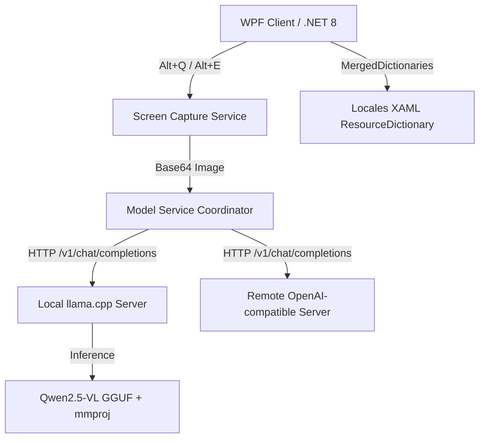

# 智译 TransPilot

**语言 / Language:**  🇨🇳 中文 | [🇺🇸 English](#english) | [🇩🇪 Deutsch](#deutsch) | [🇫🇷 Français](#français)

---

## 中文

`TransPilot`（智译）是一款专为 Windows 设计的下一代 **端侧多模态大模型（VLM）智能屏幕助手**。它集成了本地加速推理引擎 `llama.cpp` 与多模态视觉大模型 `Qwen2.5-VL`，能够离线进行精准的**截图识图翻译**与**智能表格 OCR 提取导出**，100% 保护企业与个人数据隐私。

本项目当前以**闭源包**形式分发，本仓库主要作为产品介绍、版本发布、使用说明及反馈中心。

### ✨ 核心特性

* 🌐 **多模态大语言模型智能翻译 (Alt + Q)**
  依托 `Qwen2.5-VL` 的多模态视觉能力，不仅能进行 OCR 识别，更能在截屏瞬间读懂图片上下文意图，提供多语种精准翻译。
* 📊 **端侧智能表格识别与 Excel 导出 (Alt + E)**
  对于屏幕上的任何财务报表、招投标文件或数据表格，一键截图即可全自动提取结构化数据，并一键生成标准的 `.xlsx` 文件，免去手动录入。
* 🔒 **100% 本地离线隐私保护**
  图片和截图均直接在本地内存和端侧模型中处理，**完全不需要上传至外部云服务**。适合对商业秘密、财务数据及招投标敏感数据有严格保密要求的内网及高安全级别部门。
* 🖥️ **WPF 极致美学与 10 国语言即时热切换**
  使用先进的 WPF 动态资源字典（`ResourceDictionary`）技术重构。支持中、英、德、意、西、俄、葡、日、韩、阿等 10 国语言**即时、无缝、所见即所得地全界面热更新**，告别中英混杂与闪烁卡顿。
* 🔌 **极简的 OpenAI 兼容 API 扩展**
  程序不仅能一键管理自启动的本地服务，还支持自由填写任何兼容 OpenAI / llama.cpp 的自定义服务地址，轻松接入云端或公司部署的集中式 GPU 翻译服务器。

### 🛠️ 技术架构与原理



截图翻译本质上需要"视觉理解"，不仅仅是纯文本翻译；表格识别更是严重依赖图像内容布局和框线识别。因此模型必须使用**多模态视觉模型（如 Qwen2.5-VL）**与视觉投影文件（`mmproj`），传统的纯文本大模型无法处理此类场景。

### 📥 发布版本与下载选择

#### 1. 完整包 (内置模型，解压即用)
* **发布文件名**：`TransPilot-v1.1.2-full.zip`
* **适合人群**：普通个人用户、本地单机高频使用、不想手动下载模型或配置编译环境的用户。
* **包含内容**：
  - `TransPilot.exe` 客户端主程序
  - `runtime/llama.cpp/` (已编译好的 Windows CPU 或 GPU 加速套件)
  - `runtime/models/Qwen2.5-VL-7B-Instruct-q4_k_m.gguf` (7B 主模型)
  - `runtime/models/mmproj-F16.gguf` (视觉投影文件)
  - 默认配置文件

#### 2. 标准/依赖框架包 (轻量客户端，自由接入)
* **发布文件名**：`TransPilot-v1.1.2.zip` 或 `TransPilot-FDD`
* **适合人群**：管理员、公司 IT、已有本地或远程推理服务的开发人员。
* **包含内容**：仅包含几 MB 大小的客户端主程序与配置文件，不带任何体积庞大的模型和推理后端，完全通过网络配置接入已有的 API 接口。

### 🚀 用户侧本地配置指南

**第一步：主模型与视觉投影文件下载**

```text
TransPilot/
  TransPilot.exe
  runtime/
    models/
      Qwen2.5-VL-7B-Instruct-q4_k_m.gguf  <-- 放置主模型
      mmproj-F16.gguf                      <-- 放置投影文件
```
* **[主模型下载]**：[Qwen2.5-VL-7B-Instruct-Q4_K_M.gguf](https://huggingface.co/ggml-org/Qwen2.5-VL-7B-Instruct-GGUF/resolve/main/Qwen2.5-VL-7B-Instruct-Q4_K_M.gguf)
* **[投影文件下载]**：[mmproj-F16.gguf](https://huggingface.co/unsloth/Qwen2.5-VL-7B-Instruct-GGUF/resolve/main/mmproj-F16.gguf)

**第二步：推理引擎 llama-server 下载**

从 [llama.cpp Releases 页面](https://github.com/ggml-org/llama.cpp/releases) 下载：
* **NVIDIA 显卡**：下载 `win-cuda-x64` 版本
* **纯 CPU**：下载 `win-cpu-x64` 版本

解压所有文件放置到 `runtime/llama.cpp/` 目录下即可。

### 🏢 企业集中式服务器部署

**Windows 启动脚本：**
```bat
@echo off
chcp 65001 >nul
cd /d "D:\TransPilot\llama.cpp"
llama-server.exe ^
  -m "D:\TransPilot\models\Qwen2.5-VL-7B-Instruct-q4_k_m.gguf" ^
  --mmproj "D:\TransPilot\models\mmproj-F16.gguf" ^
  -c 16384 -np 4 -ngl 25 -t 8 --port 8081 --host 0.0.0.0
```

**Linux 启动命令：**
```bash
./llama-server \
  -m /opt/models/Qwen2.5-VL-7B-Instruct-q4_k_m.gguf \
  --mmproj /opt/models/mmproj-F16.gguf \
  -c 16384 -np 4 -ngl 25 -t 8 --port 8081 --host 0.0.0.0
```

* **小团队 (5人)**：`-c 16384 -np 4`
* **中大型团队 (15-30人)**：多实例部署 + Nginx 负载均衡

### ⌨️ 快捷键

| 快捷键 | 功能 |
| :--- | :--- |
| `Alt + Q` | 截图识图翻译 |
| `Alt + E` | 表格识别与 Excel 导出 |

### ❓ 常见问题

**Q1: 启动提示"内置模型服务未成功启动"？**
检查 `runtime/llama.cpp/` 下是否有完整的 `llama-server.exe` 和 `.dll` 文件；确认显卡驱动支持 CUDA；检查任务管理器中是否有残留的 `llama-server` 进程。

**Q2: 识别或处理非常缓慢？**
确认是否启用了 GPU 加速。CPU 模式下 VLM 推理通常需要 20-30 秒。截图区域过大也会成倍增加计算量。

**Q3: 并发使用时请求失败？**
调大 `-c`（总上下文）或降低 `-np`（并发槽位），或采用多实例分流方案。

### ☕ 支持与赞助

如果 `TransPilot` 帮到了您的日常工作，欢迎通过微信支付、支付宝或 PayPal 赞助支持持续维护。

---

## English

`TransPilot` is a next-generation **on-device multimodal AI assistant** for Windows. It integrates the local inference engine `llama.cpp` with the multimodal vision model `Qwen2.5-VL`, enabling precise **screenshot translation** and **intelligent table OCR extraction** entirely offline — 100% private, no cloud uploads.

### ✨ Core Features

* 🌐 **Multimodal LLM Translation (Alt + Q)** — OCR + contextual understanding for accurate multilingual translations.
* 📊 **Table Recognition & Excel Export (Alt + E)** — One-click screenshot to structured `.xlsx` file.
* 🔒 **100% Local & Offline** — No data ever leaves your machine.
* 🖥️ **10-Language Instant UI Switching** — Chinese, English, German, Italian, Spanish, Russian, Portuguese, Japanese, Korean, Arabic.
* 🔌 **OpenAI-Compatible API** — Connect to any llama.cpp or OpenAI-compatible remote server.

### 🛠️ Architecture


VLMs are required because screenshot translation needs visual understanding of layout and context — pure text LLMs cannot handle image input.

### 📥 Downloads

| Package | Description |
| :--- | :--- |
| `TransPilot-v1.1.2-full.zip` | Bundled with models & runtime, unzip and run |
| `TransPilot-v1.1.2.zip` | Client only, connect to your own inference server |

### 🚀 Setup Guide

**Step 1 — Models:**
```text
runtime/models/
  Qwen2.5-VL-7B-Instruct-q4_k_m.gguf   ← download main model
  mmproj-F16.gguf                        ← download projection file
```
* [Main model](https://huggingface.co/ggml-org/Qwen2.5-VL-7B-Instruct-GGUF/resolve/main/Qwen2.5-VL-7B-Instruct-Q4_K_M.gguf)
* [Projection file](https://huggingface.co/unsloth/Qwen2.5-VL-7B-Instruct-GGUF/resolve/main/mmproj-F16.gguf)

**Step 2 — llama-server** from [llama.cpp Releases](https://github.com/ggml-org/llama.cpp/releases):
* NVIDIA GPU → `win-cuda-x64`
* CPU only → `win-cpu-x64`

Extract all files to `runtime/llama.cpp/`.

### 🏢 Enterprise Server Deployment

**Windows:**
```bat
llama-server.exe -m "...\Qwen2.5-VL-7B-Instruct-q4_k_m.gguf" ^
  --mmproj "...\mmproj-F16.gguf" -c 16384 -np 4 -ngl 25 --port 8081 --host 0.0.0.0
```

**Linux:**
```bash
./llama-server -m .../Qwen2.5-VL-7B-Instruct-q4_k_m.gguf \
  --mmproj .../mmproj-F16.gguf -c 16384 -np 4 -ngl 25 --port 8081 --host 0.0.0.0
```

For 15–30 users, deploy multiple instances behind Nginx load balancer.

### ⌨️ Shortcuts

| Shortcut | Function |
| :--- | :--- |
| `Alt + Q` | Screenshot translation |
| `Alt + E` | Table recognition & Excel export |

### ❓ FAQ

**Q1: "Built-in model service failed to start"?**
Verify all files exist in `runtime/llama.cpp/`, check CUDA driver support, kill any residual `llama-server` processes.

**Q2: Recognition is very slow?**
Enable GPU acceleration. CPU-only inference takes 20–30s. Reduce screenshot area size if possible.

**Q3: Concurrent request failures?**
Increase `-c` or use multi-instance deployment with Nginx.

### ☕ Support

If TransPilot saves you time, consider sponsoring via WeChat Pay, Alipay, or PayPal.

---

## Deutsch

`TransPilot` ist ein **KI-gestützter On-Device-Bildschirmassistent** für Windows. Er integriert `llama.cpp` mit `Qwen2.5-VL` für präzise **Screenshot-Übersetzung** und **Tabellen-OCR** — vollständig offline, 100% datenschutzkonform.

### ✨ Kernfunktionen

* 🌐 **Multimodale LLM-Übersetzung (Alt + Q)** — OCR + Kontextverständnis für genaue Übersetzungen.
* 📊 **Tabellenerkennung & Excel-Export (Alt + E)** — Screenshot direkt zu `.xlsx`.
* 🔒 **100% Lokal & Offline** — Keine Daten verlassen Ihren Rechner.
* 🖥️ **10-Sprachen-Sofortumschaltung** — Nahtloser Wechsel der gesamten Oberfläche.
* 🔌 **OpenAI-kompatibler API-Anschluss** — Lokaler oder Remote-Server nach Wahl.

### 📥 Download-Optionen

| Paket | Beschreibung |
| :--- | :--- |
| `TransPilot-v1.1.2-full.zip` | Inklusive Modell & Runtime, entpacken und starten |
| `TransPilot-v1.1.2.zip` | Nur Client, für eigene Inferenzserver |

### 🚀 Einrichtung

**Schritt 1 — Modelle:**
```text
runtime/models/
  Qwen2.5-VL-7B-Instruct-q4_k_m.gguf   ← Hauptmodell herunterladen
  mmproj-F16.gguf                        ← Projektionsdatei herunterladen
```
* [Hauptmodell](https://huggingface.co/ggml-org/Qwen2.5-VL-7B-Instruct-GGUF/resolve/main/Qwen2.5-VL-7B-Instruct-Q4_K_M.gguf)
* [Projektionsdatei](https://huggingface.co/unsloth/Qwen2.5-VL-7B-Instruct-GGUF/resolve/main/mmproj-F16.gguf)

**Schritt 2 — llama-server** von [llama.cpp Releases](https://github.com/ggml-org/llama.cpp/releases):
* NVIDIA GPU → `win-cuda-x64`
* Nur CPU → `win-cpu-x64`

Alle Dateien nach `runtime/llama.cpp/` entpacken.

### 🏢 Unternehmensserver-Bereitstellung

**Windows:**
```bat
llama-server.exe -m "...\Qwen2.5-VL-7B-Instruct-q4_k_m.gguf" ^
  --mmproj "...\mmproj-F16.gguf" -c 16384 -np 4 -ngl 25 --port 8081 --host 0.0.0.0
```

**Linux:**
```bash
./llama-server -m .../Qwen2.5-VL-7B-Instruct-q4_k_m.gguf \
  --mmproj .../mmproj-F16.gguf -c 16384 -np 4 -ngl 25 --port 8081 --host 0.0.0.0
```

Für 15–30 Benutzer: Mehrere Instanzen hinter Nginx-Loadbalancer.

### ⌨️ Tastenkombinationen

| Taste | Funktion |
| :--- | :--- |
| `Alt + Q` | Screenshot-Übersetzung |
| `Alt + E` | Tabellenerkennung & Excel-Export |

### ❓ FAQ

**F1: "Integrierter Modelldienst konnte nicht gestartet werden"?**
Alle Dateien in `runtime/llama.cpp/` prüfen, CUDA-Treiberunterstützung bestätigen, verbleibende `llama-server`-Prozesse beenden.

**F2: Erkennung sehr langsam?**
GPU-Beschleunigung aktivieren. CPU-Modus benötigt 20–30 Sekunden. Screenshot-Bereich verkleinern.

**F3: Anforderungsfehler bei mehreren Benutzern?**
`-c` erhöhen oder Multi-Instanz-Deployment mit Nginx einsetzen.

### ☕ Unterstützung

Wenn TransPilot Ihre Arbeit erleichtert, freuen wir uns über eine Spende via WeChat Pay, Alipay oder PayPal.

---

## Français

`TransPilot` est un **assistant IA multimodal sur appareil** pour Windows. Il intègre `llama.cpp` avec `Qwen2.5-VL` pour une **traduction de captures d'écran** précise et une **extraction OCR de tableaux** entièrement hors ligne — 100% confidentiel.

### ✨ Fonctionnalités Principales

* 🌐 **Traduction LLM Multimodale (Alt + Q)** — OCR + compréhension contextuelle pour des traductions précises.
* 📊 **Reconnaissance de Tableaux & Export Excel (Alt + E)** — Capture d'écran directement vers `.xlsx`.
* 🔒 **100% Local & Hors Ligne** — Aucune donnée ne quitte votre machine.
* 🖥️ **Commutation Instantanée 10 Langues** — Interface complète mise à jour en temps réel.
* 🔌 **API Compatible OpenAI** — Serveur local ou distant au choix.

### 📥 Options de Téléchargement

| Package | Description |
| :--- | :--- |
| `TransPilot-v1.1.2-full.zip` | Modèle & runtime inclus, décompresser et lancer |
| `TransPilot-v1.1.2.zip` | Client uniquement, pour serveur d'inférence existant |

### 🚀 Guide de Configuration

**Étape 1 — Modèles :**
```text
runtime/models/
  Qwen2.5-VL-7B-Instruct-q4_k_m.gguf   ← télécharger le modèle principal
  mmproj-F16.gguf                        ← télécharger le fichier de projection
```
* [Modèle principal](https://huggingface.co/ggml-org/Qwen2.5-VL-7B-Instruct-GGUF/resolve/main/Qwen2.5-VL-7B-Instruct-Q4_K_M.gguf)
* [Fichier de projection](https://huggingface.co/unsloth/Qwen2.5-VL-7B-Instruct-GGUF/resolve/main/mmproj-F16.gguf)

**Étape 2 — llama-server** depuis [llama.cpp Releases](https://github.com/ggml-org/llama.cpp/releases) :
* GPU NVIDIA → `win-cuda-x64`
* CPU uniquement → `win-cpu-x64`

Extraire tous les fichiers dans `runtime/llama.cpp/`.

### 🏢 Déploiement Serveur Entreprise

**Windows :**
```bat
llama-server.exe -m "...\Qwen2.5-VL-7B-Instruct-q4_k_m.gguf" ^
  --mmproj "...\mmproj-F16.gguf" -c 16384 -np 4 -ngl 25 --port 8081 --host 0.0.0.0
```

**Linux :**
```bash
./llama-server -m .../Qwen2.5-VL-7B-Instruct-q4_k_m.gguf \
  --mmproj .../mmproj-F16.gguf -c 16384 -np 4 -ngl 25 --port 8081 --host 0.0.0.0
```

Pour 15–30 utilisateurs : plusieurs instances derrière un Nginx en load balancing.

### ⌨️ Raccourcis Clavier

| Raccourci | Fonction |
| :--- | :--- |
| `Alt + Q` | Traduction de capture d'écran |
| `Alt + E` | Reconnaissance de tableau & export Excel |

### ❓ FAQ

**Q1 : "Échec du démarrage du service de modèle intégré" ?**
Vérifier tous les fichiers dans `runtime/llama.cpp/`, confirmer le support CUDA, terminer les processus `llama-server` résiduels.

**Q2 : Reconnaissance très lente ?**
Activer l'accélération GPU. Le mode CPU prend 20–30 secondes. Réduire la taille de la zone capturée.

**Q3 : Échecs de requêtes en utilisation concurrente ?**
Augmenter `-c` ou utiliser un déploiement multi-instances avec Nginx.

### ☕ Support

Si TransPilot vous fait gagner du temps, vous pouvez soutenir le développement via WeChat Pay, Alipay ou PayPal.
