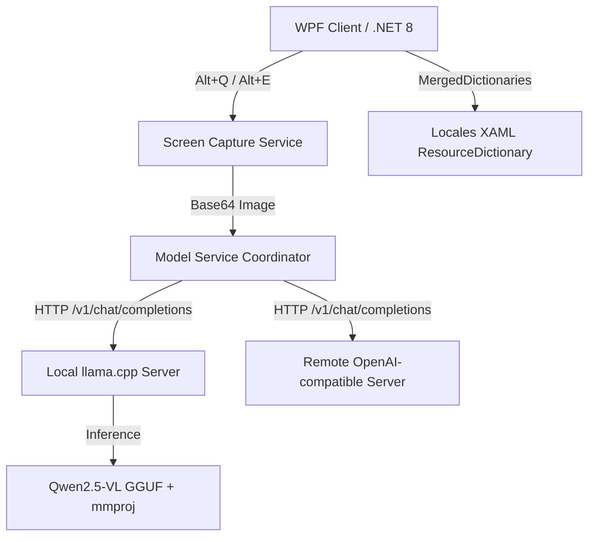

# 智译领航 TransPilot - LLM 智能屏幕翻译与表格识别工具

---

`TransPilot`（智译）是一款专为 Windows 设计的下一代 **端侧多模态大模型（VLM）智能屏幕助手**。它集成了本地加速推理引擎 `llama.cpp` 与多模态视觉大模型 `Qwen2.5-VL`，能够离线进行精准的**截图识图翻译**与**智能表格 OCR 提取导出**，100% 保护企业与个人数据隐私。

本项目当前以**闭源包**形式分发，本仓库主要作为产品介绍、版本发布、使用说明及反馈中心。

---

## ✨ 核心特性

* 🌐 **多模态大语言模型智能翻译 (Alt + Q)**
  依托 `Qwen2.5-VL` 的多模态视觉能力，不仅能进行 OCR 识别，更能在截屏瞬间读懂图片上下文意图，提供多语种精准翻译。
* 📊 **端侧智能表格识别与 Excel 导出 (Alt + E)**
  对于屏幕上的任何财务报表、招投标文件或数据表格，一键截图即可全自动提取结构化数据，并一键生成标准的 `.xlsx` 文件，免去手动录入。
* 🔒 **100% 本地离线隐私保护**
  图片和截图均直接在本地内存和端侧模型中处理，**完全不需要上传至外部云服务**。适合对商业秘密、财务数据及招投标敏感数据有严格保密要求的内网及高安全级别部门。
* 🖥️ **WPF 极致美学与 10 国语言即时热切换**
  使用先进的 WPF 动态资源字典（`ResourceDictionary`）技术重构。支持中、英、德、意、西、俄、葡、日、韩、阿等 10 国语言**即时、无缝、所见即所得地全界面热更新**，告别中英混杂与闪烁卡顿。
* 🔌 **极简的 OpenAI 兼容 API 扩展**
  程序不仅能一键管理自启动的本地服务，还支持自由填写任何兼容 OpenAI / llama.cpp 的自定义服务地址，轻松接入云端或公司部署的集中式 GPU 翻译服务器。

---

## 🛠️ 技术架构与原理



### 为什么必须用多模态大模型（VLM）？
截图翻译本质上需要“视觉理解”，不仅仅是纯文本翻译；表格识别更是严重依赖图像内容布局和框线识别。因此模型必须使用**多模态视觉模型（如 Qwen2.5-VL）**与视觉投影文件（`mmproj`），传统的纯文本大模型无法处理此类场景。

---

## 📥 发布版本与下载选择

我们根据不同的使用场景，提供以下两种分发包形式：

### 1. 完整包 (内置模型，解压即用)
* **发布文件名**：`TransPilot-v1.1.2-full.zip`
* **适合人群**：普通个人用户、本地单机高频使用、不想手动下载模型或配置编译环境的用户。
* **包含内容**：
  - `TransPilot.exe` 客户端主程序
  - `runtime/llama.cpp/` (已编译好的 Windows CPU 或 GPU 加速套件)
  - `runtime/models/Qwen2.5-VL-7B-Instruct-q4_k_m.gguf` (7B 主模型)
  - `runtime/models/mmproj-F16.gguf` (视觉投影文件)
  - 默认配置文件

### 2. 标准/依赖框架包 (轻量客户端，自由接入)
* **发布文件名**：`TransPilot-v1.1.2.zip` 或 `TransPilot-FDD`
* **适合人群**：管理员、公司 IT、已有本地或远程推理服务的开发人员。
* **包含内容**：仅包含几 MB 大小的客户端主程序与配置文件，不带任何体积庞大的模型和推理后端，完全通过网络配置接入已有的 API 接口。

---

## 🚀 用户侧本地配置指南

如果您使用的是**标准包**，或者希望在完整版中自定义/更新自己的模型与环境，请参考以下配置步骤：

### 第一步：主模型与视觉投影文件下载
程序内置约定的模型目录如下：
```text
TransPilot/
  TransPilot.exe
  runtime/
    models/
      Qwen2.5-VL-7B-Instruct-q4_k_m.gguf  <-- 放置主模型
      mmproj-F16.gguf                      <-- 放置投影文件
```
* **[主模型下载]**：[Qwen2.5-VL-7B-Instruct-Q4_K_M.gguf (7B 推荐量化档位)](https://huggingface.co/ggml-org/Qwen2.5-VL-7B-Instruct-GGUF/resolve/main/Qwen2.5-VL-7B-Instruct-Q4_K_M.gguf)
* **[投影文件下载]**：[mmproj-F16.gguf (必须与主模型配套)](https://huggingface.co/unsloth/Qwen2.5-VL-7B-Instruct-GGUF/resolve/main/mmproj-F16.gguf)

### 第二步：推理引擎 llama-server 下载
请根据您的电脑显卡配置，从 [llama.cpp Releases 页面](https://github.com/ggml-org/llama.cpp/releases) 下载对应的运行套件：
* **有英伟达 (NVIDIA) 显卡**（强烈推荐，速度极快）：下载文件名带 `win-cuda-x64` 的包，例如 [llama-b8733-bin-win-cuda-12.4-x64.zip](https://github.com/ggml-org/llama.cpp/releases/download/b8733/llama-b8733-bin-win-cuda-12.4-x64.zip)。
* **无独显/纯 CPU 运行**：下载文件名带 `win-cpu-x64` 的包，例如 [llama-b8733-bin-win-cpu-x64.zip](https://github.com/ggml-org/llama.cpp/releases/download/b8733/llama-b8733-bin-win-cpu-x64.zip)。

下载后，解压出其中的 `llama-server.exe`、`llama.dll`、`ggml.dll` 等所有文件，并全部放置到项目的 `runtime/llama.cpp/` 目录下即可。

---

## 🏢 企业集中式服务器部署指南

为了多人共用、降低单机资源开销并统一管控，建议在企业局域网服务器（配备强 GPU）中统一部署 `llama.cpp`，并将所有员工电脑上的客户端 API 指向该地址。

### 1. Windows 服务器启动脚本示例
在服务器上将 `llama.cpp` 和模型放好后，新建批处理 `start-server.bat` 运行：
```bat
@echo off
chcp 65001 >nul
cd /d "D:\TransPilot\llama.cpp"
llama-server.exe ^
  -m "D:\TransPilot\models\Qwen2.5-VL-7B-Instruct-q4_k_m.gguf" ^
  --mmproj "D:\TransPilot\models\mmproj-F16.gguf" ^
  -c 16384 ^
  -np 4 ^
  -ngl 25 ^
  -t 8 ^
  --port 8081 ^
  --host 0.0.0.0
```

### 2. Linux 服务器启动命令示例
```bash
./llama-server \
  -m /opt/models/Qwen2.5-VL-7B-Instruct-q4_k_m.gguf \
  --mmproj /opt/models/mmproj-F16.gguf \
  -c 16384 \
  -np 4 \
  -ngl 25 \
  -t 8 \
  --port 8081 \
  --host 0.0.0.0
```

### 3. 多人并发配置建议（`-c` 与 `-np` 的平衡）
* **小团队 (5人左右)**：单实例即可满足。推荐配置：`-c 16384 -np 4` (16k总上下文，支持4个并发槽位分时共享)。
* **中大型团队 (15-30人)**：建议使用**多实例部署**防掉线与排队。在服务器上分配不同的端口启动两个 `llama-server` 实例，并通过 Nginx 进行反向代理和负载均衡分配。

---

## ⌨️ 快捷键说明

| 快捷键 | 功能描述 |
| :--- | :--- |
| `Alt + Q` | **截图识图翻译**：截取屏幕区域，自动进行图像 OCR 提取、上下文意图翻译并在右侧面板渲染，支持一键复制。 |
| `Alt + E` | **表格识别**：截图框选表格，识别结构并在右侧预览，自动导出并直接生成本地 `.xlsx` 表格文件。 |

---

## 🌐 多国语言界面支持

通过设置窗口中即可无缝热刷新 10 种语言界面：
* 🇨🇳 简体中文 (zh-CN) | 🇺🇸 English (en) | 🇩🇪 Deutsch (de)
* 🇮🇹 Italiano (it) | 🇪🇸 Español (es) | 🇷🇺 Русский (ru)
* 🇵🇹 Português (pt) | 🇯🇵 日本語 (ja) | 🇰🇷 한국어 (ko)
* 🇸🇦 العربية (ar)

---

## ❓ 常见问题 FAQ

#### Q1: 为什么启动时提示“内置模型服务未成功启动”？
* 请检查 `runtime/llama.cpp/` 目录下是否完整放齐了 `llama-server.exe` 和所有依赖的 `.dll` 文件。
* 检查显卡驱动是否支持 CUDA，若不支持，请将 `llama-server` 更换为 CPU 版本。
* 在任务管理器中确认是否有残留的 `llama-server` 进程占用了端口，如果有请将其强制结束。

#### Q2: 为什么截图识别或表格处理非常缓慢？
* 确认是否启用了 GPU 硬件加速。如果完全运行在 CPU 上，由于 VLM 模型计算开销巨大，通常需要 20-30 秒才能返回结果。
* 确认截图的分辨率和尺寸，截图区域过大（如双 4K 屏）会成倍增加模型的 Token 计算量。

#### Q3: 并发多人使用时出现请求失败？
* 视觉大语言模型（VLM）请求需要大量的 VRAM。如果并发量较大，请调大启动参数中的 `-c`（总上下文）或降低并发槽位数 `-np`，也可采用本指南推荐的多实例分流方案。

---

## ☕ 支持与赞助

如果 `TransPilot` 帮到了您的日常工作，欢迎请作者喝一杯咖啡以支持我们持续维护：
我们在程序主界面及赞助窗口（内置在关闭/设置流程的温和提醒中）集成了支持通道。欢迎使用微信支付、支付宝扫码或通过海外 PayPal 进行赞助。
